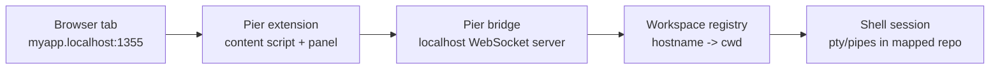

# Pier

In-browser terminal for your `*.localhost` apps with [Portless](https://github.com/vercel-labs/portless), mapped to the right repo automatically.

```diff
- "dev": "pnpm dev"
+ "dev": "pier myapp pnpm dev"  # http://myapp.localhost:1355
```

[Website](https://pier.himan.me) • [Docs](https://pier.himan.me/docs)

## Quick Start

```bash
# Install
npm install -g portless @malviyahimanshu/pier

# One-time setup (starts bridge and prints token + ws URL)
pier setup

# Run an app through a stable localhost hostname
pier myapp pnpm dev
# -> http://myapp.localhost:1355
```

Load the extension:

```bash
pier extension path
```

Then in Chrome/Chromium:

1. Open `chrome://extensions`
2. Enable **Developer mode**
3. Click **Load unpacked**
4. Select the directory printed by `pier extension path`

Open the app URL and press `Ctrl+\`` to toggle the Pier panel.

## Why Pier

When you build multiple apps or agents in parallel, context switching becomes expensive:

- **Terminal sprawl**: too many terminal windows tied to different repos
- **Tab ambiguity**: many localhost tabs with unclear workspace context
- **Wrong-shell errors**: commands run in the wrong directory
- **Storage collisions**: cookies/localStorage overlap across localhost apps

Pier keeps each project self-contained in one tab:

- app UI at a stable `*.localhost` hostname (via `portless`)
- in-page terminal panel (xterm.js + local bridge)
- hostname -> repo routing with session reuse

## Usage

```bash
# Basic
pier myapp pnpm dev
# -> http://myapp.localhost:1355

# Subdomain-style apps
pier api.myapp pnpm dev
# -> http://api.myapp.localhost:1355

# Inspect routing
pier map list
pier map where myapp.localhost
```

### package.json Script

```json
{
  "scripts": {
    "dev": "pier myapp pnpm dev"
  }
}
```

## How It Works



1. `pier <name> <cmd...>` wraps `portless` and records `<name>.localhost -> cwd`
2. Pier ensures the local bridge is running
3. Extension connects to the bridge with token auth
4. Bridge resolves the page hostname to a workspace path
5. Terminal session is created or reused in that workspace

## Commands

```bash
pier <name> <cmd...>         # run app with mapping + bridge bootstrap

# Mapping
pier map list
pier map add <host.localhost> [cwd]
pier map remove <host.localhost>
pier map where <host.localhost>

# Bridge
pier bridge start [--foreground]
pier bridge stop
pier bridge status
pier bridge logs

# Extension & diagnostics
pier extension path
pier doctor
pier setup
```

## Security

- Bridge binds to localhost by default (`127.0.0.1`)
- WebSocket requires token authentication
- Extension only activates on localhost-style pages
- Bridge upgrade checks allow only localhost + extension origins

## Development

```bash
pnpm install
pnpm run build
pnpm run check
```

Local loop:

```bash
pnpm run build:extension --watch
pnpm run typecheck
pnpm run test:unit
pnpm run test:smoke
```

## Repo Layout

- `packages/shared` - shared validation, protocol, terminal settings
- `packages/cli-core` - CLI implementation and workspace routing registry
- `packages/bridge-core` - local WebSocket + terminal bridge server
- `packages/extension-src` - extension source (TS/TSX + static assets)
- `extension/` - generated unpacked extension assets
- `cli/`, `server/`, `bin/` - compatibility shims
- `docs/` - source docs for users and contributors

## Docs

Live docs: https://pier.himan.me/docs

Source docs in repo:

- [Setup](docs/setup.md)
- [Usage](docs/usage.md)
- [Configuration](docs/configuration.md)
- [Architecture](docs/architecture.md)
- [Troubleshooting](docs/troubleshooting.md)
- [Contributing](docs/contributing.md)
- [Release](docs/release.md)

## Requirements

- Node.js 20+
- `portless`
- Chrome or Chromium (Manifest V3)

## License

ISC
